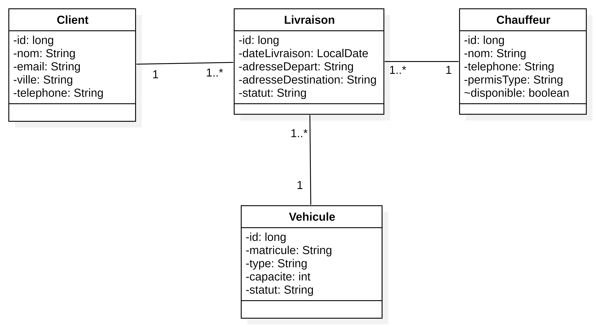
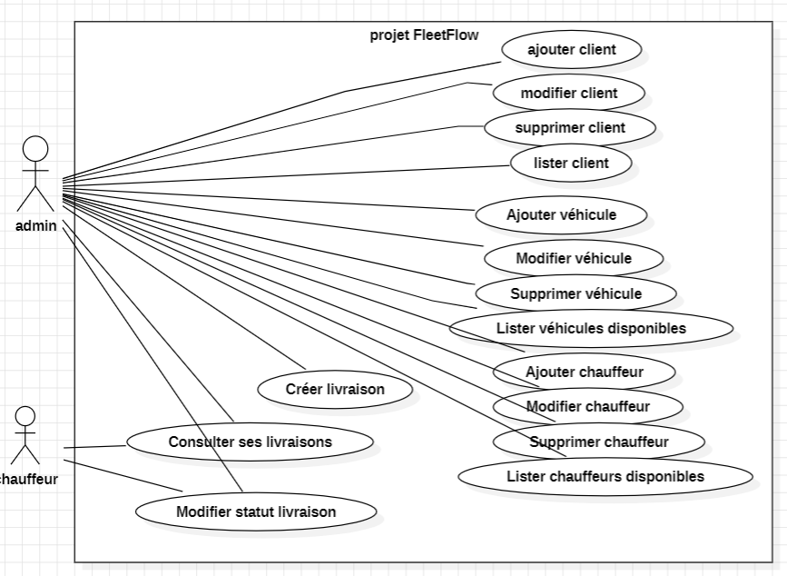

-----------------------------------------------------------------------------------

- Pour construire et lancer tous les services (application + base de données) :

docker compose up --build

- Pour arrêter les conteneurs :

docker compose down

- Une fois l’application démarrée, vous pouvez vérifier qu’elle fonctionne via Swagger :

👉 URL :

http://localhost:8080/swagger-ui.html

ou :

http://localhost:8080/swagger-ui/index.html

fleetflow part 5

{
"username": "youssef_dev",
"email": "youssef@fleet.com",
"password": "123",
"role": "CHAUFFEUR",
"nom": "Youssef El Amrani",
"telephone": "0611223344",
"permisType": "C"
}